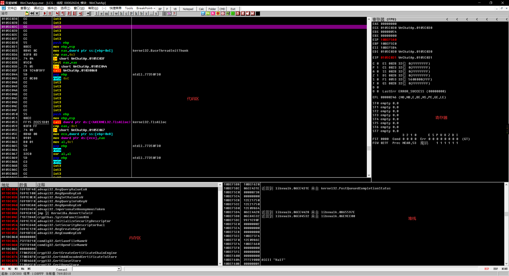

# PE-reverse-courseware
PE reverse courseware PE逆向课件 基础教学大纲

更具案例来实战

# 案例1: Wechat 逆向
准备工具:
- Cheat Engine
- OD
- VS2019 

### OD 快速入门
1. open wechat
2. open od
3. od 附加方式打开wechart

##### 查询内存区域方式
内存区Command search
- 更具内存区域位置查询 `DD 内存位置`
- 查询以中文编码显示 `DC 内存位置`
- 查询以UTF8编码显示 `DU 内存位置`
##### 快速调试
- F2 断点
- `Ctrl + B`  查看所有断点
- `Ctrl + F9` 执行到返回
- 右键断点 可设置条件断点

### CE 快速入门

注意这里所说的基地址是  软件编译后生成的  也就是说微信V1  和微信V2 他们的地址就是不同的

我们现在通过以上手法去找微信的User Struct中的地址

通过我们用CE找到的地址 在用OD去查询

这里应该是有用户的LOGO的 没有 可能是指针我们通过DD搜索内存区域  上下翻找看看

不出意料 找到了  7BE04394
然后去计算他的基地址

WeChatWin.dll + x = 7BE04394
已知 WeChatWin.dll  = 7A690000
x = 1774394‬
地址 LIST:
- WeChatWin.dll + 17744D0  用户名
- WeChatWin.dll + 1774394‬  用户头像
- WeChatWin.dll+1774100    用户名
- WeChatWin.dll+17740CC    手机号
- WeChatWin.dll+1774520    移动端OS